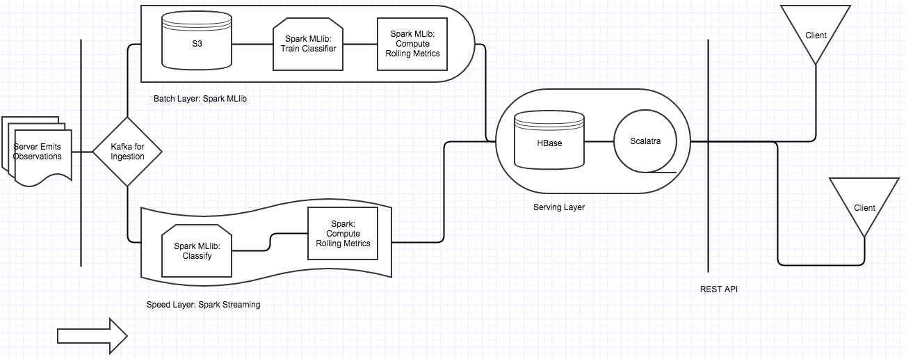
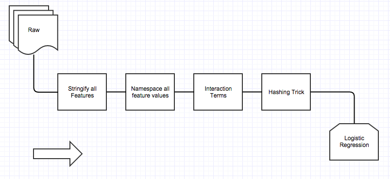
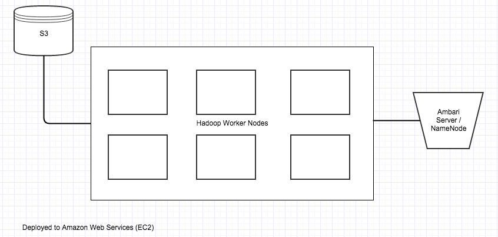

# Adtech-dash: Scalable Ad Classification Pipeline, REST API, and Visualization

#### David Chen
Data Scientist in Residence, Sept 2015 - Dec 2015

---

### Purpose

+ Scalable Data Pipeline to ingest high frequency Ad click data, train classifier, release rolling evaluation metrics via REST API
+ Allow GET requests for Area Under Precision-Recall Curve (evaluation metric) for classifier on all data from training up to time queried, taken every minute
e.g. Metric up to 10:30 AM on Jan 19.
+ Snazzy Data Visualization using [Highcharts](http://www.highcharts.com/) (Creative Commons licence)
+ Example Request	
		
		GET /classifier/metrics.json with
		params: {
			since: 1453183367829 (epoch time in milliseconds)
			until: 1453187951889
		}

+ Example Response:
		
		{"classifierMetricsBundles":
			[{
				"timestamp":1453183380000,
				"auPRC": 0.7716374828714161,
				"classifierLastRetrained":1453345085844},
			...
			}]
		}
			
	

### Dataset

+ Criteo Display Advertising Dataset [here](http://labs.criteo.com/downloads/2014-kaggle-display-advertising-challenge-dataset/)
+ Each observation is an ad: ~20 count features, ~20 categorical features, with Yes/No whether it was clicked
+ Classifier predicts Yes/No whether it was clicked
+ Class imbalance (Yes is ~2%)
+ Unknown high number of categories
+ 45 million observations
+ 12 GB
+ Simulated to stream in at 1/ms in my tests

For feature engineering, classifier choice and classifier evaluation, we used techniques outlined in ["Simple and scalable response prediction for display advertising"](http://dl.acm.org/citation.cfm?id=2532128) by OLIVIER CHAPELLE at Criteo, EREN MANAVOGLU at Microsoft, ROMER ROSALES at LinkedIn.

### Design Requirements

+ Ingest high frequency timestamped data (many per millisecond)
+ Large datasets (many TBs)
+ Distributed
+ Fault-tolerant
+ Individual parts easy to scale out by buying more commodity machines
+ Using well-supported open source technologies
+ Programming Languages that scale to larger codebases

### Technology Choices

+ Scala Programming Language: Type Safety, talks to Java ecosystem
+ Hadoop: Big Data
+ Kafka: fault-tolerant, distributed, fast Queue
+ Spark: Fast Big Data analytics processing
+ Spark MLlib: Fast distributed machine learning
+ Spark Streaming: Real-time streaming
+ Amazon Web Services: cloud-based, easy to restart in case of machine failure
+ HBase: fault tolerant, distributed key-value database
+ Scalatra: REST API web
+ Lambda Architecture
+ ScalaTest: Unit and Integration Testing
+ Highcharts: Beautiful time series charts

### Architecture (Lambda Architecture - Inspired)

We use Kafka to ingest the data into a distributed queue. Two consumers consume this queue: one simply dumps the observation with timestamp into S3, the other is a Spark Streaming app to give up to the minute rolling evaluation metrics. A batch Spark job trains the classifier and pushes it to the Spark Streaming App to be reloaded, and it generates rolling stats. Both the batch job and Spark Streaming App dump timestamped metrics into HBase in the Serving Layer. Scalatra exposes a REST API and serves the single page app in Highcharts. The Highcharts visualization is a separate client app that uses Ajax to get data from the REST API.

### Machine Learning Details

We use a simplified version of the method in the paper above. 

#### Feature Engineering
We consider all features as categorical of strings (including numerical features!).
We then namespace all values by prepending values with "f" + feature number.
We then take all interaction terms (e.g. x, y -> x;x, x;y, y;x, y:y).
We then apply the "Hashing Trick": this turns an observation vector in to a bit vector. We use 24 bits here.

		def hashing_trick(vector v, hash_function h, int num_bits):
			result = array of num_bits boolean false
			for each index j of v:
				i = absolute value of (h(v(j)) mod num_bits)
				result[i] = not result[i]
			return result
			
Then we train Logistic Regression on this hashed bit vector. We used Spark MLLib's Logistic Regression with LBFGS.

### Cluster Setup

This was a 7 machine cluster: 6 workers and 1 NameNode and Ambari Server for monitoring. This was deployed on Amazon Web Services Elastic Compute Cloud (EC2). S3 is a datastore also on AWS.

### Future Directions
+ Bayesian Logistic Regression to smooth hierarchical features and take into account long time dynamics
+ Stress Test
+ Finer metrics

